# PETRONAS Sovereign Knowledge Graph (Federation Master Graph)
**Synthesized across arifOS, WEALTH, GEOX, AAA, and Personal Canon**  
**Date:** 2026-09-05 | **Classification:** F13 SOVEREIGN INTELLIGENCE | **Epistemic Anchor:** F2 TRUTH (OBS > DER > INT > SPEC)

---

## 1. Executive Ontology & Core Doctrine

This knowledge graph unifies 36 months of internal investigation, quantitative modeling, institutional decay forensics, and geopolitical intelligence scattered across 85+ files on this machine.

```
                  ┌─────────────────────────────────────────────────────────┐
                  │                 006_PETRONAS_PARADOX                    │
                  │   National Institution Outgrows Its Label (1974-2026)   │
                  └────────────────────────────┬────────────────────────────┘
                                               │
             ┌─────────────────────────────────┼─────────────────────────────────┐
             │                                 │                                 │
             ▼                                 ▼                                 ▼
   [ FINANCIAL & STRUCTURAL ]        [ INSTITUTIONAL & BEHAVIORAL ]    [ SOVEREIGN & GEOPOLITICAL ]
   • WEALTH petronas_vitals          • Third Axis (Vitality/Sim)       • SEARAH × Petros Dispute
   • FY25/1H26 IFR Reality           • Phase C Calhoun Death           • Sarawak DGO 2016 Aggregator
   • Decommissioning RM50B+          • Faisal Dossier (Decay)          • Suriname 1 BBOE Camouflage
   • PRefChem RM14.8B Trap           • Universe 25 / Beautiful Mouse   • Eni UK JV / Petrofac 2.0
             │                                 │                                 │
             └─────────────────────────────────┼─────────────────────────────────┘
                                               │
                                               ▼
                         ┌───────────────────────────────────────────┐
                         │   COLLAPSE TRAJECTORY v3 (45.7% / 10y)    │
                         │       Peak Risk: FY2028 (RM94B Loss)      │
                         └─────────────────────┬─────────────────────┘
                                               │
             ┌─────────────────────────────────┴─────────────────────────────────┐
             ▼                                                                   ▼
   [ PUBLIC MEANING & ARTICLES ]                                       [ ARBITRAGE & CAREER VECTOR ]
   • MakcikGPT (arif-fazil.com)                                        • Arif Fazil (Geologist + Economist)
   • CLAIM_LEDGER.yaml (F2 Spine)                                      • Exit Target: March 2027
   • Minyak Kita, Khazanah Kita                                        • "Petronas as Angel Investor"
```

---

## 2. Comprehensive Master Mermaid Graph

```mermaid
graph TB
    subgraph S_CANON ["I. CONSTITUTIONAL & ONTOLOGICAL FOUNDATION"]
        G006["GENESIS 006: PETRONAS Paradox<br/><i>Label (Petroleum) ≠ Reality (Superset)</i>"]
        G024["GENESIS 024: Sovereign Energy Intel<br/><i>Hydrocarbon Decline × AI Compute Grid</i>"]
        G003["GENESIS 003: Andersen-Calhoun Fable<br/><i>Institutional Shadow & Simulation</i>"]
    end

    subgraph S_FINANCE ["II. FINANCIAL REALITY & BALANCE SHEET DECAY"]
        VITALS["WEALTH: petronas_vitals.py / json<br/><i>Triadic Pulse: BODY (0) | SPINE (33.6) | SOUL (22.2)</i>"]
        DEEPDIVE["2026-08-29 Deepdive Bundle<br/><i>IFR 1H2026 Forensic Accounting</i>"]
        
        P_HEADLINE["[P1] PAT +4% Headline 'Resilience'<br/><i>Reported RM27.2B</i>"]
        R_PAT["[R1] Underlying PAT -73.3%<br/><i>True Core: RM7.0B</i>"]
        R_PREFCHEM["[A1] PRefChem Trap<br/><i>RM14.8B Non-cash Loss Recog</i>"]
        R_CRUDE["[R4] Domestic Crude -17%<br/><i>657 kboe/d vs 730kb Refined</i>"]
        R_DEBT["[R6/R7] USD Debt Wall<br/><i>RM110.4B USD (87.1%), Gearing 21.2%</i>"]
        R_DECOM["Decommissioning Overhang<br/><i>RM50B+ Unfunded Liability</i>"]
        R_DIV["Federal Dividend Drain<br/><i>RM20-32B/yr vs RM11.6B True FCF</i>"]
    end

    subgraph S_INSTITUTION ["III. INSTITUTIONAL DECAY (CALHOUN PHASE C)"]
        THIRDAXIS["PETRONASThirdAxisCollapse2026<br/><i>Simulation Index: 0.6424</i>"]
        FAISAL["Faisal Dossier (2026-06-25)<br/><i>Death of 1974 Monopoly Model</i>"]
        HAMPA["HAMPA: Calhoun Behavioral Sink<br/><i>Zero Friction, Bureaucratic Death</i>"]
        BEAUTIFUL_MOUSE["The 'Beautiful Mouse'<br/><i>Groomed Performers Masking Decay</i>"]
    end

    subgraph S_GEOPOLITICS ["IV. SOVEREIGN GEOPOLITICS & FRACTURE"]
        SEARAH["SEARAH × PETROS (Eni JV)<br/><i>Companies House UK #17027115</i>"]
        PETROS["PETROS Aggregator Mandate<br/><i>Sarawak DGO 2016 Gas Monopoly</i>"]
        SURINAME["Suriname Block 52 (1 BBOE)<br/><i>High-Cost Camouflage Asset</i>"]
        VEHICLE2["Hidden Vehicle #2 (Hassan)<br/><i>PCSB Sarawak Entity Carve-Out</i>"]
        PETROFAC["Petrofac 2.0<br/><i>Convicted Counterparty Governance Risk</i>"]
    end

    subgraph S_TRAJECTORY ["V. QUANTITATIVE COLLAPSE MODEL (v3)"]
        MODEL_V3["PETRONAS_Collapse_Trajectory_v3<br/><i>P(Collapse 10y) = 45.7%</i>"]
        PEAK_2028["Peak Shock Window: FY2028<br/><i>11.2% Density | Quantum Loss RM94B</i>"]
        SCEN_A["Scen A: Survival (10% | 2%)"]
        SCEN_B["Scen B: Slow Bleed (35% | 20%)"]
        SCEN_C["Scen C: Fire Sale (35% | 70%)"]
        SCEN_D["Scen D: Detente Trap (10% | 45%)"]
        SCEN_E["Scen E: Black Swan (10% | 95%)"]
    end

    subgraph S_PUBLIC ["VI. PUBLIC VOICE & MEANING MEMBRANE"]
        MAKCIK["MakcikGPT Articles (arif-fazil.com)<br/><i>petronas-atm-kerajaan.ts, petronas-dna.ts</i>"]
        CLAIM_LEDGER["CLAIM_LEDGER.yaml<br/><i>18 F2-Grounded Claims (OBS/DER)</i>"]
    end

    subgraph S_ARIF ["VII. SOVEREIGN HUMAN VECTOR (ARIF FAZIL)"]
        ARIF_ROLE["Arif Fazil (Dual Lens)<br/><i>Upstream Geologist + Energy Economist</i>"]
        EXIT_2027["Exit Target: March 2027<br/><i>Decision Gate: Jan 2027 Audit</i>"]
        ANGEL_FRAME["'Petronas as Angel Investor'<br/><i>Salary Fuels arifOS Sovereign Tech Stack</i>"]
        F7_GUARD["F7 Insider Bias Guard<br/><i>Distinguish Disillusionment from Evidence</i>"]
    end

    %% Linkages & Causality Chains
    G006 --> VITALS
    G006 --> FAISAL
    G003 --> THIRDAXIS
    G024 --> MODEL_V3

    P_HEADLINE -.->|Masks Reality| R_PAT
    R_PREFCHEM --> R_PAT
    R_PAT --> VITALS
    R_CRUDE --> VITALS
    R_DEBT --> VITALS
    R_DIV --> VITALS
    R_DECOM --> VITALS

    VITALS -->|Underlying Cash Starvation| MODEL_V3
    R_PREFCHEM -->|Downstream Capex Sink| MODEL_V3
    R_DIV -->|Fiscal Extraction Trap| SCEN_B
    R_DIV -->|Capital Depletion| SCEN_C

    THIRDAXIS --> HAMPA
    HAMPA --> BEAUTIFUL_MOUSE
    BEAUTIFUL_MOUSE -->|Suppresses Internal Alarm| FAISAL
    FAISAL --> MODEL_V3

    PETROS -->|Sarawak Gas Sequestration| FAISAL
    PETROS -->|Eats Domestic Margin| R_CRUDE
    SEARAH -->|Eni Dilution / Off-Balance| PETROS
    SEARAH --> VEHICLE2
    SURINAME -->|Praise Camouflage| BEAUTIFUL_MOUSE
    SURINAME --> SCEN_D
    PETROFAC --> SCEN_E

    MODEL_V3 --> PEAK_2028
    MODEL_V3 --> SCEN_A
    MODEL_V3 --> SCEN_B
    MODEL_V3 --> SCEN_C
    MODEL_V3 --> SCEN_D
    MODEL_V3 --> SCEN_E

    CLAIM_LEDGER --> MAKCIK
    R_DIV --> MAKCIK
    R_CRUDE --> MAKCIK

    ARIF_ROLE -->|36 Mo Inside Witness| THIRDAXIS
    ARIF_ROLE -->|Macro Modeling| MODEL_V3
    ARIF_ROLE -->|Public Translation| MAKCIK
    ARIF_ROLE --> EXIT_2027
    EXIT_2027 --> ANGEL_FRAME
    F7_GUARD -.->|Enforces Epistemic Humility| ARIF_ROLE
```



---

## 3. Node Inventory & System Cross-Reference Table

| Cluster | Entity / File Identifier | Verified Path | Type | Key Metric / Insight |
|---|---|---|---|---|
| **Canon** | `GENESIS_006` | `/root/arifOS/GENESIS/006_PETRONAS_PARADOX.md` | Ontology | The name is a subset; the entity is a national infrastructure superset. |
| **Canon** | `GENESIS_024` | `/root/arifOS/GENESIS/024_PETRONAS_SOVEREIGN_ENERGY_INTELLIGENCE.md` | Strategy | Shift from hydrocarbon exports to sovereign AI datacenter thermal grid. |
| **Canon** | `GENESIS_003` | `/root/arifOS/GENESIS/003_ANDERSEN_CALHOUN_FABLE.md` | Philosophy | Institutional simulation, behavioral sink, and bureaucratic entropy. |
| **Vitals** | `petronas_vitals` | `/root/WEALTH/wealth_core/petronas_vitals.py` | Compute | Triadic distance-to-trip engine: BODY (0), SPINE (33.6), SOUL (22.2). |
| **Vitals** | `petronas_vitals.json` | `/root/arif-fazil.com/.../petronas_vitals.json` | SOT Data | FY2025 IFR: CFFO RM85.2B − capex RM41.6B − div RM32B = true FCF RM11.6B. |
| **Deepdive** | `00_QUANTITATIVE.md` | `/root/forge_work/2026-08-29-petronas-deepdive/` | Financials | Underlying PAT collapsed 73.3% (RM7.0B vs reported RM27.2B). |
| **Deepdive** | `08_KNOWLEDGE_GRAPH`| `.../final_bundle/08_KNOWLEDGE_GRAPH.md` | Forensics | 7 Propaganda claims (P1-P7) vs 10 Realities (R1-R10) & 5 Voids (V1-V5). |
| **Trajectory**| `MODEL_V3_2026` | `/root/arifOS/memory/entities/PETRONAS_Collapse_Trajectory_v3_2026.json` | Model | 45.7% 10y collapse probability; peak density FY2028; RM94B quantum loss. |
| **Trajectory**| `THIRDAXIS_2026` | `/root/arifOS/memory/entities/PETRONASThirdAxisCollapse2026.json` | Model | Simulation index 0.6424; Calhoun Phase C locked-in risk by mid-2027. |
| **Decay** | `FAISAL_DOSSIER` | `/root/WEALTH/forge_work/faisal_dossier/PETRONAS_INSTITUTIONAL_DECAY_2026-06-25.md` | Forensics | Death of 1974 single-allocator monopoly; corporate expansion vs national thermal erosion. |
| **Decay** | `HAMPA_CALHOUN` | `/root/ariffazil/HAMPA/wealth-audit-calhoun-petronas-2026-07-03.md` | Behavioral | Institutional behavioral sink: zero conflict, compliance fetish, Ψ sidelining. |
| **Geopolitics**| `SEARAH_TRUTH` | `/root/AAA/memory/investigations/SEARAH-TRUTH.md` | Intel | Eni UK JV (No. 17027115); PETROS Sarawak domestic gas aggregator dispute. |
| **Geopolitics**| `CLAIM_LEDGER` | `/root/AAA/artifacts/petronas-leaflet-2026-06-20/CLAIM_LEDGER.yaml` | Evidence | 18 F2-grounded claims verifying public leaflet against Annual Reports. |
| **Public** | `MAKCIK_ARTICLES` | `/root/arif-fazil.com/.../src/data/makcikgpt/` | Content | `petronas-atm-kerajaan.ts`, `petronas-dna.ts` (public macroeconomic awareness). |
| **Career** | `ARIF_CAREER` | Internal Sovereign State | Human | Exit target: March 2027. Angel investor mindset. Jan 2027 audit gate. |

---

## 4. The Five Structural Death Spirals (Dynamic Feedback Loops)

### Loop 1: The Fiscal Extraction Death Spiral
$$\text{Federal Deficit} \xrightarrow{\text{MOF Demand}} \text{Super-Dividends (RM32B)} \xrightarrow{\text{CFFO Depletion}} \text{FCF Drops to RM11.6B} \xrightarrow{\text{Borrowing for Capex}} \text{USD Debt Surges (87.1\%) }$$
* **Mechanic:** The Malaysian Government treats Petronas as the national ATM. When dividends exceed true underlying Free Cash Flow, capital is diverted from upstream exploration and maintenance to fund federal operational expenditures.

### Loop 2: The Upstream Cannibalization Spiral
$$\text{Domestic Depletion} \xrightarrow{\text{Crude Drops -17\%}} \text{Refineries Require Imported Crude} \xrightarrow{\text{PRefChem Loss}} \text{Upstream Capex Squeezed to 21\%} \xrightarrow{\text{Zero Domestic Replacement}}$$
* **Mechanic:** PRefChem Downstream takes 63% of capital expenditures (RM26.0B), leaving Upstream starving with only 21% (RM8.7B). Malaysia now produces ~350-360 kboe/d of crude while refinery capacity is 730-740 kboe/d, making the nation structurally dependent on imported crude oil.

### Loop 3: The Sarawak Sovereign Fracture
$$\text{Sarawak DGO 2016} \xrightarrow{\text{PETROS Aggregator}} \text{Loss of Upstream Gas Margin} \xrightarrow{\text{MLNG Dilution / Eni JV}} \text{Hidden Vehicle \#2 Carve-out} \xrightarrow{\text{Collapse of 1974 Monopoly}}$$
* **Mechanic:** The 1974 Petroleum Development Act (PDA) granted exclusive rights. PETROS has effectively broken this monopoly in Sarawak. Upstream gas, Kasawari, and LNG value chains are progressively carved out, leaving federal Petronas with legacy liabilities and declining Peninsular basins.

### Loop 4: The Calhoun Phase C Institutional Lock-in
$$\text{Disillusionment of Builders} \xrightarrow{\text{Exit of } \Psi \text{ Talent}} \text{Rise of 'Beautiful Mice' (Simulators)} \xrightarrow{\text{Perfect PowerPoint Compliance}} \text{Elimination of Friction/Killing Projects} \xrightarrow{\text{Blind Walk into FY2028 Shock}}$$
* **Mechanic:** The organization exhibits zero friction and perfect narrative centralization. Critical technical warnings are suppressed because compliance and career preservation dominate over truth (F2). High-cost overseas vanity projects (Suriname Block 52) are celebrated as triumphs to camouflage domestic upstream exhaustion.

### Loop 5: The Decommissioning Time Bomb
$$\text{Aging Offshore Infrastructure} \xrightarrow{\text{RM50B+ Unfunded Liability}} \text{Cash Reserves Allocated to Dividends} \xrightarrow{\text{Procrastinated Well Abandonment}} \text{Environmental & Balance Sheet Shock}$$
* **Mechanic:** Over RM50B in eventual decommissioning costs are deferred year after year. As fields reach economic cut-off, abandonment liabilities will crystallize directly onto a depleted balance sheet.

---

## 5. Arif Fazil's Career Vector & Epistemic Decoupling

* **Current Role:** PETRONAS Geologist + Energy Economist (Inside Witness).
* **The Emotional / Career Reality:** Arif identifies the culture as *"propa, no role, narrative > reality"*.
* **The Reframing (F13 Doctrine):**
  * **Petronas is an Angel Investor:** Do not view the job as a career ladder; view it as a high-value angel investor funding the computational infrastructure, memory architecture, and development of arifOS, WEALTH, and GEOX.
  * **Timeline:** Hard exit target by **March 2027**.
  * **Decision Gate:** Formal constitutional audit gate in **January 2027** to measure sovereign runway, commercial traction of arifOS/WEALTH, and personal autonomy index.
  * **F7 Humility Rule:** The internal intelligence must strictly separate Arif's personal workplace frustration from cold, empirical balance-sheet realities. The models (v3, Vitals, IFR forensics) stand on mathematical and accounting evidence, not grievance.
