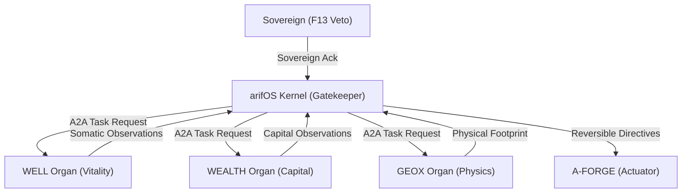

# CROSS-DISCIPLINARY MAPPING & ARCHITECTURE HARDENING
## Entropy Integrity Mesh (Agentic Integrity Observability)
*Ratified: 2026-07-12*

---

### 1. Cross-Disciplinary Mapping

#### 🌌 Physics
*   **Thermodynamics & Entropy:** The Second Law states that total entropy ($S$) of an isolated system always increases. Powerful agents (corporations, AI pipelines) create local order (minimizing local entropy) by exporting disorder, risk, and waste to the environment. The mesh quantifies this exported disorder via `wealth_entropy_externality` (locally ordered, globally entropic).
*   **Landauer's Principle:** Erasing 1 bit of information dissipates at least $kT \ln 2$ of heat. Suppressing or erasing feedback, sensor channels, or witness dissent is physically entropic and directly causes structural information loss (`INFORMATION_LOSS`).

#### 🧠 Philosophy
*   **Kantian Deontology:** Axiom 3 ("Humans are ends, not optimization material") is a direct translation of Kant's Categorical Imperative (Formula of Humanity).
*   **Popperian Falsificationism:** Axiom 6 ("Preserve correction") enforces that a system's theories and decisions must remain falsifiable. A system that deletes dissent or hides negative feedback is unfalsifiable and self-sealing.
*   **Gödelian Incompleteness:** Axiom 10 ("The agent may not certify itself") prevents the logical paradox of self-referential validation.

#### 📈 Economics
*   **Moral Hazard & Principal-Agent Problem:** Decoupling authority from downside risk exposure (Axiom 8) leads to moral hazard. We measure this gap mathematically using the `consequence_gap` metric.
*   **Goodhart's Law & Lucas Critique:** Axiom 7 addresses metric substitution ("When a measure becomes a target, it ceases to be a good measure"). The WEALTH organ monitors KPI gaming via `wealth_metric_purpose_audit`.

#### 👥 Social Science
*   **System Drift & Employee Silence:** Autocratic or high-surveillance systems create apparent order while suppressing feedback. This increases defensive overhead and masks catastrophic tail fragility (`brittle_order`).
*   **ASEAN Relational Governance (Maruah/Adab):** Structural humility and dignity-first axioms ensure that actors are never reduced to diagnostic labels or mere variables.

#### 🎨 Art
*   **Negative Space (Ma / 間):** In aesthetics, preserved silence or whitespace is critical for composition. The mesh protects human optionality and "blanks" (unmodeled spaces) via privacy entropy, resisting complete behavioral extraction.

#### 🕌 Religion
*   **Niat & Amal (Intent vs Deed):** Axiom 4 ("Intention does not erase consequence") aligns with the theological principle that declared good intention (niat) is invalid if the deed (amal) causes unaddressed harm. Accountability requires physical repair (tawbah/amends).

#### ⚖️ Politics
*   **Separation of Powers:** Axiom 10 aligns with Montesquieu's separation of powers. The actor executing (AFORGE) must be separated from the router (Kernel), the witness (WELL/WEALTH/GEOX), and the judge (arifOS/F13).

#### 🤖 AI LLM Literature
*   **Corrigibility (Hubinger et al.):** The mesh monitors corrigibility as a trajectory, tracking how an agent responds to corrective challenges over multiple turns.
*   **Constitutional AI (Anthropic):** Moves beyond static rules to observe the system's reasoning geometry (certainty creep, responsibility diffusion) prior to tool execution.

---

### 2. Hardened Architecture Specifications

To prevent the Entropy Integrity Mesh from becoming an authoritarian "centralized moral officer," we enforce these security controls:

1.  **Veto & Autonomy Locks:**
    *   No organ can write or modify permissions autonomously. All metrics map to `reflect_only` signals.
    *   VOID states require F13 sovereign authorization; the Kernel is limited to drafting HOLD recommendation postures.
2.  **Epistemic Humility Caps:**
    *   Confidence scores are capped at `0.95`. Absolute certainty in any signal triggers a `CERTAINTY_IMMUNITY` alert.
3.  **Data Isolation Boundaries:**
    *   Human biometric baselines are private to the WELL organ and never transmitted in cross-organ A2A metadata. Only normalized signals (e.g. `integrity_entropy`) are shared.
4.  **Origin Validation & Token Scope:**
    *   Each cross-organ A2A task uses temporary scoped JWT tokens containing `session_id` and `sct_v1` continuity variables.
5.  **Reversible Actuator Pattern:**
    *   AFORGE may only run counterfactual checks and compile release artifacts. Execution of mutations is restricted to gated tasks requiring human witness signatures.
